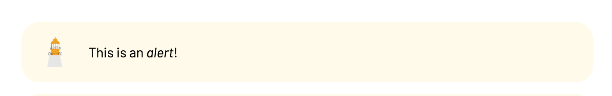
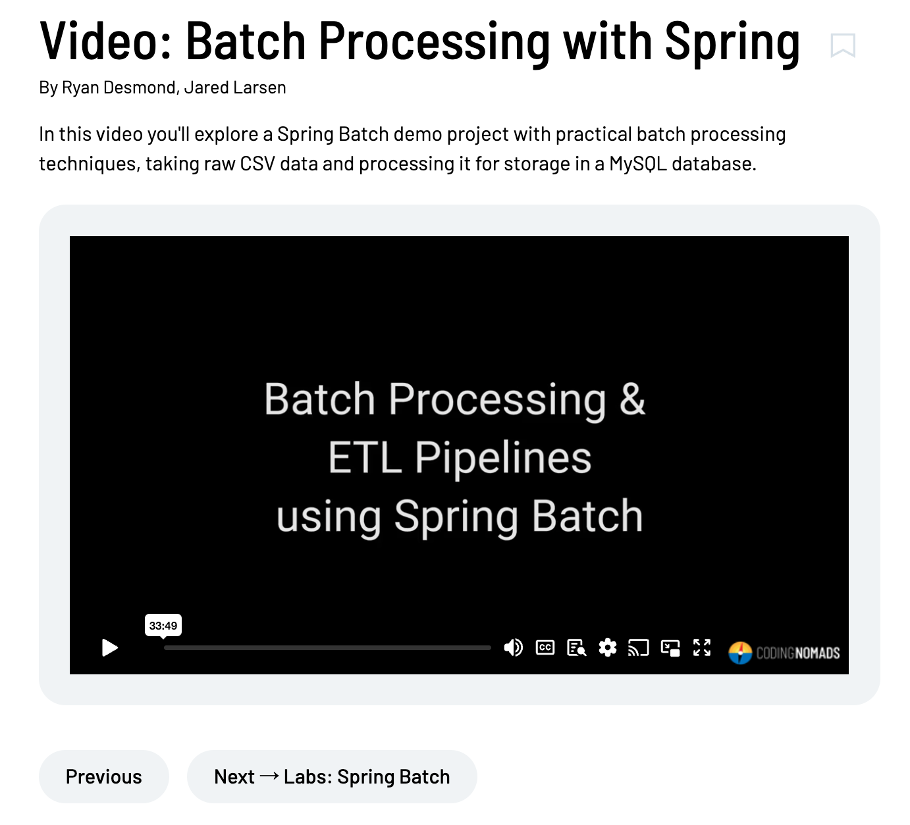
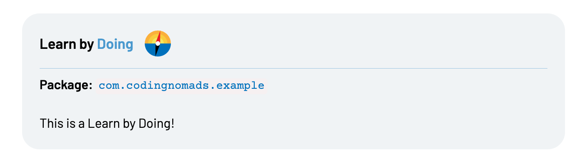
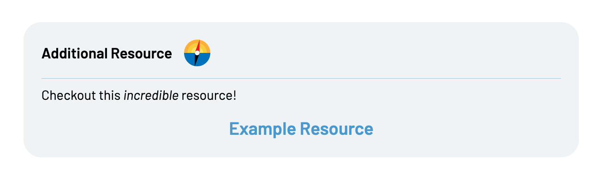

Until these creator docs recieve a complete overhaul, here is a quick guide to formatting content for the new platform [https://codingnomads.com](https://codingnomads.com)

**Notes**

Notes require an opening and closing tag, and can contain markdown inside.

```
[[note]]
This is a note.
[This is a link](http://example.com).
This is still the same paragraph.
[[/note]]
```


Blank lines = a new paragraph in the rendered html:

```
[[note]]
This is a note [This is a link](http://example.com).

Hello, _this is Markdown_ and a second paragraph!

This is the third paragraph of a note with **bold**.
[[/note]]
```


**Alerts**

Alerts work the same way:

```
[[alert]]
This is an _alert_!
[[/alert]]
```




**Videos** 

Videos are single-tag (no closing tag) and require an `id` attribute:

```
[[video id="77834767"]]
```

For "Video" lessons, please include the lesson description in the body above the embedded video:

```
In this video you'll explore a Spring Batch demo project with practical batch processing techniques, taking raw CSV data and processing it for storage in a MySQL database.

[[video id="764391747"]]
```




**Images**

Images can be single-tag and require a `src` attribute:

```
[[img src="http://www.image.com/location"]]
```

Images support `alt` and `title` attributes (and _should_ include them), values must be wrapped in double quotes:

```
[[img src="http://www.image.com/location" alt="image alt text" title="The Title of This Image"]]
```

Image tags can be written in a multi-line format, and also support a `link` attribute which opens in a new tab by default:

```
[[img
	src="http://www.image.com/location"
	alt="image alt text" 
	title="The Title of This Image"
	link="https://example.com"
]]
```

**Learn by Doing**

Require an opening and closing tags:

```
[[learn-by-doing]]
**Package:** `com.codingnomads.example`

This is a Learn by Doing!

[[/learn-by-doing]]
```




**Links**

Links use standard markdown syntax and will open in new tab by default:

```
[Google](https://google.com)
```

Links can add an optional title that is displayed as a tool-tip:

```
[Google](https://google.com "The best search engine for privacy")
```

**External Resources**

For link blocks to additional resources:

````
[[external-resource src="https://example.com" link-text="Example Resource"]]

Checkout this _incredible_ resource!

[[/external-resource]]
```



