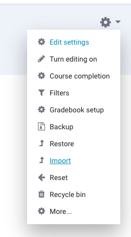
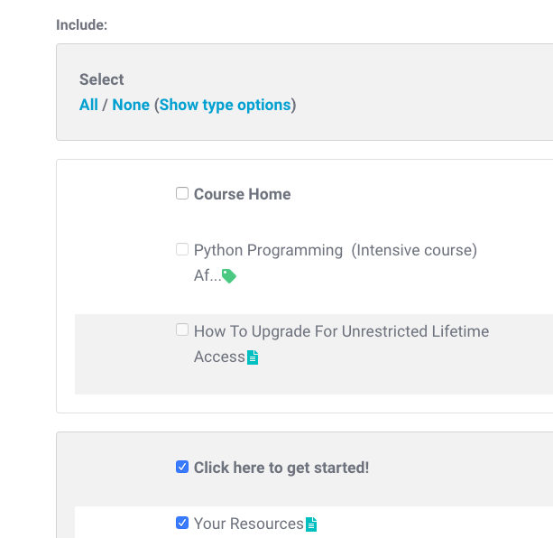

# Course Creation Basics

This page introduces you to the basic ideas around creating courses for CodingNomads. In short, we want our courses to build on mixing the following four concepts:

1. Read
2. Watch
3. Code
4. Reflect

Let's talk in more detail how you can implement these four concepts.

## Read

Written course material gives students a structured and searchable way to gain knowledge. While for many learners it may not be the most engaging way to learn, it serves its purpose in introducing concepts and making it easy to go back to when needing to fill memory gaps.

We have [guidelines for technical writing](01-content-guidelines.md) that you should follow when creating the written materials for your course. In short: be clear and structured, and have fun.

## Watch

**Walkthrough:** Show every new concept at least once before students are meant to complete it by themselves. Screencast walkthroughs are great for this exposure. Having seen the challenge completed once makes it much easier for students to learn.

## Code

**Labs:** While _understanding_ is crucial, it isn't enough for learning something new. In our courses, we use short programming exercises called "labs" for practice. Training the learned concepts helps to understand them better, as well as giving the needed repetition to train the learner's muscle-memory.

**Project-Oriented:** Students learn best through building projects. Our brains only remember new concepts when there's a compelling reason to do so. Build well-designed projects gives students both the justification on _why_ to learn something new, as well as satisfaction on completing it. This is why we aim to build our courses project-oriented.

**Capstone Project:** The final capstone project of a course allows students to employ their creativity and their own interests. A good capstone project is framed well and allows students to bring together all the knowledge they gained throughout the course. At the same time it avoids hand-holding students through it, and gives them enough freedom to customize it towards their personal interests. We want to send our students off with a great project to put on their portfolio, as well as with the tools and mindset that they are able to create and accomplish their ideas by themselves.

## Reflect

Reflection is essential for retention of learned content, which is why it helps students when you push them to look back and synthesize their new knowledge.

**Quiz Checkpoints:** Interlaced with the written and video course content, students encounter quizzes that serve as checkpoints for themselves. Answering quiz questions forces them to synthesize the content they previously passively consumed. It also allows them to understand whether they got a grip on the previous section's content, or whether they will have to study it some more.

**Writing Prompts:** To encourage students to further reflect on their learning process, you can include writing prompts (e.g. "Journal" resources, or [open-ended quiz questions](05-quiz-question-types.md#open-ended-text-questions)). 

---

# How To Duplicate a Resource

Starting with our copied skeleton course resource, the easiest may be to duplicate a resource and then replace the content. This is the recommended way of starting to build your course, since it keeps important settings intact. The following video shows you how to duplicate an existing resource in our platform:

<iframe width="560" height="315" src="https://www.youtube.com/embed/fSOzDZjKlIw" frameborder="0" allow="accelerometer; autoplay; encrypted-media; gyroscope; picture-in-picture" allowfullscreen></iframe>

# How to Duplicate a Section From Another Course

**Note:** You will probably _not_ need to do this, but since it has come up, here are the steps.

You can copy sections from other courses also in your role as a `Teacher`. To do so, click on the cogwheel-symbol on the top right of your course page, then on `Import`:

Next, select the course you want to import from, and then select the Sections/Resources you need:

Keep clicking through the prompts until you're finished, and the imported resources will be merged with the resources you already have in your course in the respective sections.