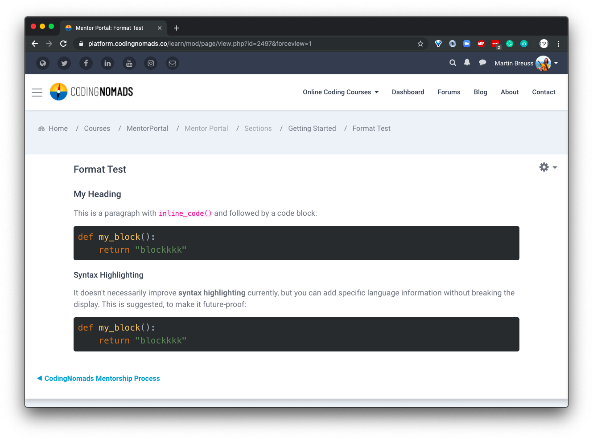

# Markdown Course Creation

We advise to use **Markdown** for writing your course content. It is simple to read and write, introduces consistency through limiting options, and makes the content easy to re-use in other contexts. Write in Markdown rather than using a text editing program such as MS Word or Google Docs.

It is also better to use Markdown than directly creating your content inside our learning platform. The latter can sometimes be a drag due to the content box window sizing and other platform-related small annoyances. It might also make the content too site-specific and difficult to transition elsewhere. We've made this mistake before, and would prefer to avoid accruing more technical debt.

Here is a screencast that explains how to add your Markdown content to a resource in our platform:

<iframe width="560" height="315" src="https://www.youtube.com/embed/fNW_77QC67E" frameborder="0" allow="accelerometer; autoplay; encrypted-media; gyroscope; picture-in-picture" allowfullscreen></iframe>

## Headings

As a small deviation from keeping your content as platform-agnostic as possible, you should use lower-level headings as your page's main headings:

- **Main Headings:** Use `<h3>` (or `###` in Markdown) as your page content's main heading.
- **Sub-Headings:** Use `<h4>` (or `####` in Markdown) as your page content's sub-headings.

The course content will be integrated in our platform, and higher-level headings are reserved for course and page headings, which need to be entered in a different entry form.

## Links

We want to make sure that all links open up in a new tab when clicked, to avoid students from accidentally navigating away from the course. Markdown syntax doesn't have an equivalent to HTML's `target="_blank"` which would allow to open links in new tabs. Therefore, please use real HTML for creating links in your Markdown docs:

```html
This is <a href="http://your.url" target="_blank">a link</a>
```

## Code And Code Blocks

Code snippets wrapped in single backticks as well as code blocks with triple-backticks are correctly rendered by the platform's Markdown engine.

## Example Markdown Rendering

When entering your content in Markdown, it will look like that during input:


The above Markdown text will correctly render in our platform like so:



## Text Editor Choice

You can change your default text editor in your user profile's cogwheel drop-down `Editor Preferences`. Choose `Marklar` for the easiest Markdown editing functionality.

The **Marklar** editor allows you to:

* **write** your content in Markdown
* **preview** with a simple button click
* **add images** through a straightforward file upload

The video below shows how to change your text editor preferences. Follow the instructions, but instead of selecting the "Plain Text Editor", choose the new **"Marklar"** editor option. The rest of the process is the same. After you selected the correct editor, your page editing should like like this:


<iframe width="560" height="315" src="https://www.youtube.com/embed/GeHyN-TZ5JY" frameborder="0" allow="accelerometer; autoplay; encrypted-media; gyroscope; picture-in-picture" allowfullscreen></iframe>