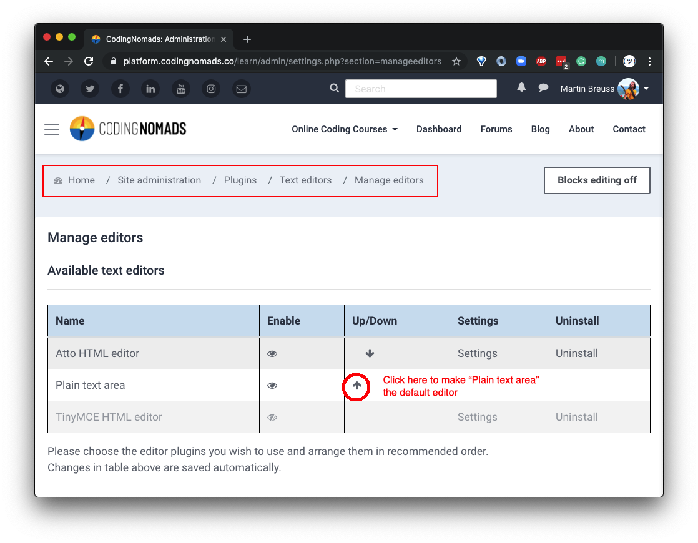
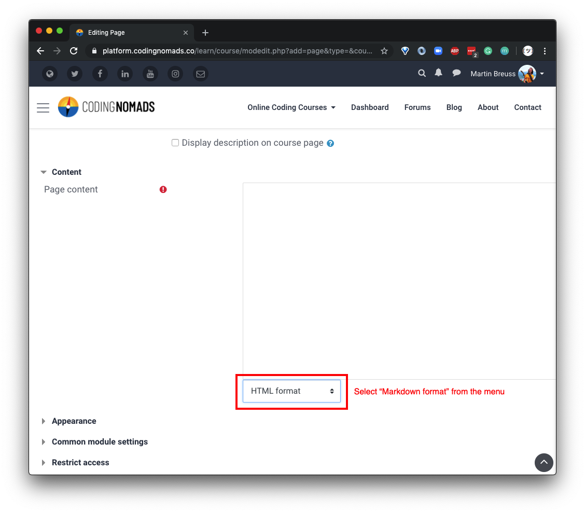

# Markdown Course Creation

We advise to use **Markdown** for writing your course content. It is simple to read and write, introduces consistency through limiting options, and makes the content easy to re-use in other contexts. Write in Markdown rather than using a text editing program such as MS Word or Google Docs.

It is also better to use Markdown than directly creating your content inside our learning platform. The latter can sometimes be a drag due to the content box window sizing and other platform-related small annoyances. It might also make the content too site-specific and difficult to transition elsewhere. We've made this mistake before, and would prefer to avoid accruing more technical debt.

Here is a screencast that explains how to add your Markdown content to a resource in our platform:

<iframe width="560" height="315" src="https://www.youtube.com/embed/fNW_77QC67E" frameborder="0" allow="accelerometer; autoplay; encrypted-media; gyroscope; picture-in-picture" allowfullscreen></iframe>

## Headings

As a small deviation from keeping your content as platform-agnostic as possible, you should use lower-level headings as your page's main headings:

- **Main Headings:** Use `<h3>` (or `###` in Markdown) as your page content's main heading.
- **Sub-Headings:** Use `<h4>` (or `####` in Markdown) as your page content's sub-headings.

The course content will be integrated in our platform, and higher-level headings are reserved for course and page headings, which need to be entered in a different entry form.

## Code And Code Blocks

Code snippets wrapped in single backticks as well as code blocks with triple-backticks are correctly rendered by the platform's Markdown engine.

## Example Markdown Rendering

When entering your content in Markdown, it will look like that during input:

The above Markdown text will correctly render in our platform like so:

## Text Editor Choice

Due to an overlap of a moodle theme we are using, it is currently not possible to individually change the text editor preference. Therefore, you can't easily switch to Markdown input yourself. We aim to get that fixed, but for now please contact a site admin to change the default editor site-wise when you'll be adding your content to the site. After you finish, we will need to change it back.

It will remember the Plain Text Editor type you used to initially create a page, and when editing the page it will re-open with the Markdown editor selected.

## Changing The Default Text Editor

**Note:** Currently this needs to be done by a site administrator:

